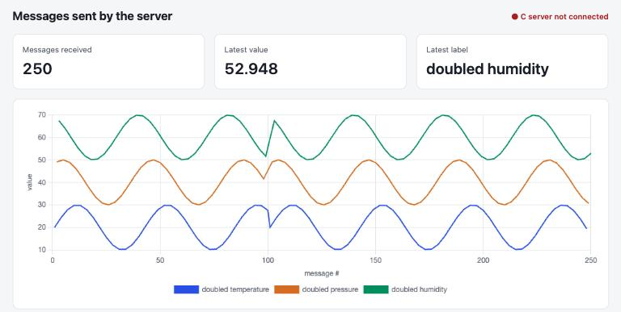

# socket-message-demo

Two C processes, a client and a server, exchange messages over a TCP socket on `127.0.0.1:5555`. Each message holds a float value and a string label.

```
client ──(5555)──▶ server ──(5556)──▶ gui/dashboard.py ──(SSE, 8000)──▶ browser
       ◀─ replies ─┘
```



*The dashboard after two client runs (100 messages, then 150). The jump at message 100 is where the second run starts its sine waves over.*

## Build

```bash
make
```

## Run

Use three terminals, started in this order.

**Terminal 1: dashboard.** Start it, then open http://127.0.0.1:8000 in a browser.

```bash
python3 gui/dashboard.py
```

**Terminal 2: server.**

```bash
./server
```

**Terminal 3: client.** Both arguments are optional: the number of messages (default 100) and the delay between them in milliseconds (default 200).

```bash
./client
```

The client sends a stream of synthetic readings labelled `temperature`, `pressure` and `humidity`. The server replies to each with the value doubled and `"doubled "` prefixed to the label, and forwards the same reply to the dashboard.

The dashboard is optional. The server tries to connect to it before each message and ignores it if it is not running, so it can be started or restarted at any time. It uses only the Python standard library; the page loads Chart.js from cdnjs.

## Wire format

| Field | Type | Notes |
|---|---|---|
| value | `uint32` | IEEE-754 bits of the float, network byte order |
| len | `uint8` | label length (max 255) |
| label | `char[len]` | no trailing NUL |
